# 🎮 Mobile Game Challenge App

Welcome to the **Mobile Game Challenge App** – a fast, fun, and competitive Android game where users face off in a variety of skill-based challenges. Designed for both solo play and thrilling multiplayer showdowns, this app turns your phone into a rapid-fire game arena.


## 🌟 Overview

This app offers a unique twist on classic mobile games by compiling a suite of micro-challenges under one roof. Whether you're trying to swipe faster than your opponent, shake your device to hit the top score, or answer tricky questions under pressure, there's something here for every type of casual gamer.

Built with **Java** and **Android Studio**, the app is designed with clean modular code, separating each challenge into its own activity and managing multiplayer synchronization using **Firebase Realtime Database**.

---

## 🎮 Game Modes

### 🧍 Single Player
Train your reflexes, brain, and fingers by playing mini-games one after the other. This mode is perfect for warming up, improving scores, or just killing time.

### 🧑‍🤝‍🧑 Multiplayer Mode
Challenge your friends (on separate devices) in real-time. The app uses Firebase to sync game state, determine who won, and display a satisfying result screen — 🟢 **green** if you win, 🔴 **red** if you lose. No delays. Just fast, fair, and fun action.


## 🧩 Challenges Included

Each mini-game is implemented as its own Activity for modular control and scalability:

- **Catch the Dot**  
  Tap a most dots before you can under time pressure. Fast reactions are key.

- **Quiz Game**  
  Answer multiple-choice questions under time pressure.

- **Shake It**  
  Shake your device as hard and fast as you can before the timer runs out, a fun music plays once the user starts shaking

- **Swipe It**  
  Swipe in the correct directions shown on-screen in a timed sequence.

- **Tap Fast**  
  Tap the button as many times as possible in a short time span.

- **True or False**  
  Judge statements quickly and accurately.

Each of these challenges tests a different skill: speed, coordination, memory, knowledge, or reaction time.


---

## 🔧 Tech Stack

| Category       | Tools/Frameworks         |
|----------------|--------------------------|
| Language       | Java                     |
| IDE            | Android Studio           |
| Backend        | Firebase Realtime DB     |
| UI             | Android Views, XML       |
| Architecture   | Activity-based (modular) |
| Sync           | Realtime Firebase events |

---


## 🧱 Design Pattern Used

### 🧩 ChallengeManager – Centralized Game Logic Controller

The app employs a **Singleton-like Manager Pattern** through the `ChallengeManager` class. This utility class acts as a centralized controller for managing:

- ✅ The current challenge state
- 🧮 Score tracking for each challenge
- 🔁 Transitioning between challenges
- 🔄 Resetting or replaying challenges
- 🏆 Determining win/loss outcomes (especially in multiplayer mode)

By consolidating challenge-related logic in one place, `ChallengeManager` helps:

- Reduce redundant code across activities  
- Enforce consistency in game flow  
- Simplify debugging and future feature additions (like combo scoring or bonuses)

This is a clean example of **Separation of Concerns**, where UI components (Activities) focus purely on interaction, while the `ChallengeManager` handles core game logic behind the scenes.


## Architecure

Here is the game architecure

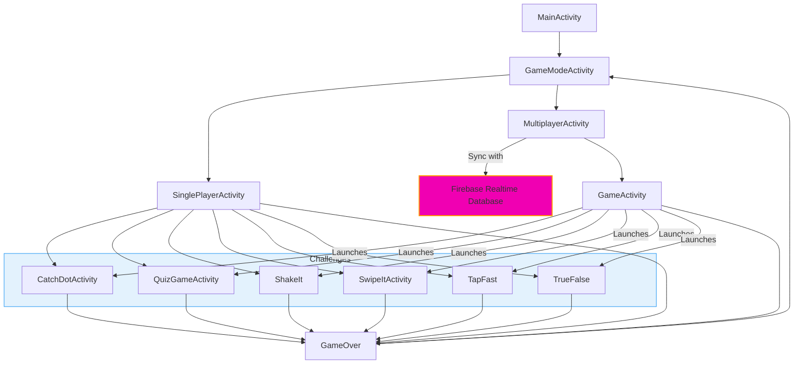

## 🧠 Game Logic

- Each challenge extends from a base structure allowing consistent transitions and results handling.
- The challenges start each time in a random order (see GameActivity.java)
- Challenge manager tracks each user's score on each challenge
- Multiplayer mode uses Firebase to:
  - Create a shared counter
  - Determine the winner based on the sign of the counter
- Results are displayed immediately after both players finish, ensuring real-time feedback.

---

## 📂 Project Structure

```
com.bdg.mobilegame/
├── challenges/
│   ├── CatchDotActivity.java
│   ├── QuizGameActivity.java
│   ├── ShakeIt.java
│   ├── SwipeItActivity.java
│   ├── TapFast.java
│   └── TrueFalse.java
├── utils/
│   ├── Challenge.java
│   ├── ChallengeManager.java
│   ├── ChallengesAdapter.java
│   ├── GameActivity.java
│   ├── GameModeActivity.java
│   ├── GameOver.java
│   ├── MainActivity.java
│   ├── MultiplayerActivity.java
│   └── SinglePlayerActivity.java
```

---

## ⚙️ How to Run

### 🔨 Prerequisites

- Android Studio (latest stable version)
- Firebase Project + `google-services.json` in your `app/` directory
- Android device or emulator

### 🛠 Setup

1. **Clone the repository**  
   ```bash
   git clone https://github.com/yourusername/mobile-game-challenge.git
   cd mobile-game-challenge
   ```

2. **Open in Android Studio**  
   Select the `app/` folder and let Gradle sync.

3. **Configure Firebase**  
   - Add your `google-services.json` in the `app/` directory
   - Make sure your Firebase Database Rules are set appropriately for development/testing.

4. **Build and Run**  
   Choose a device/emulator and hit `Run`.

---


## 📸 Screenshots

<div style="display: flex; overflow-x: auto; gap: 10px; padding: 10px; border: 1px solid #ddd; border-radius: 8px;">
  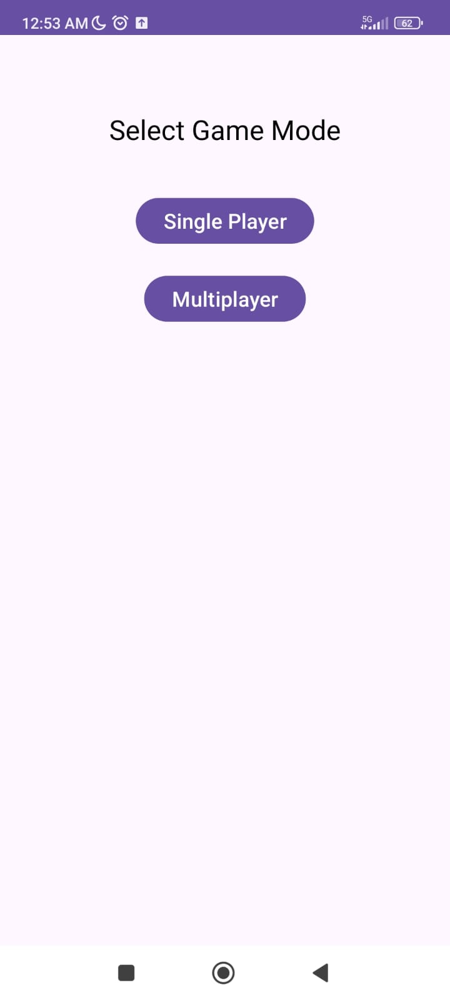
  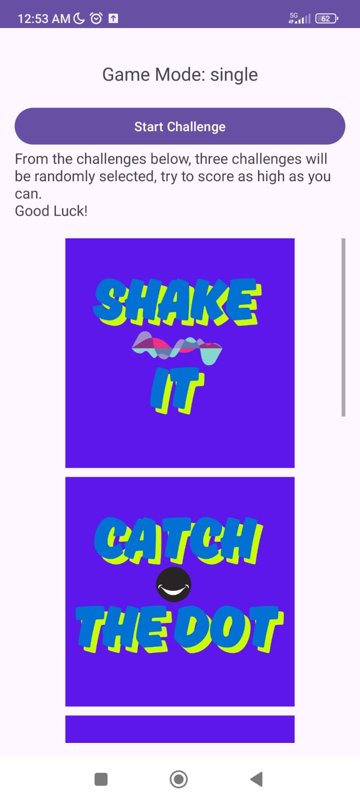
  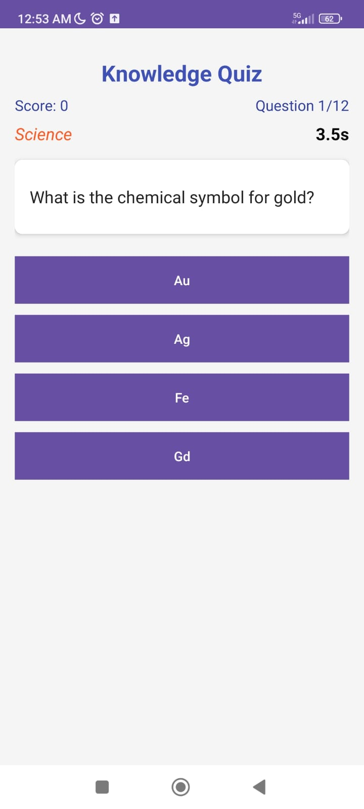
  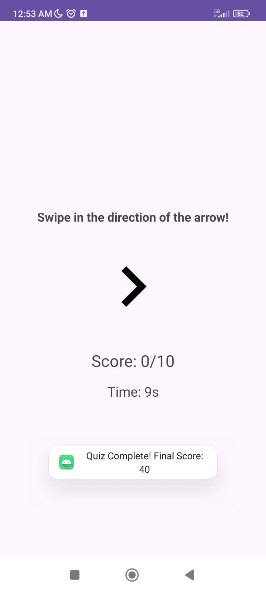
  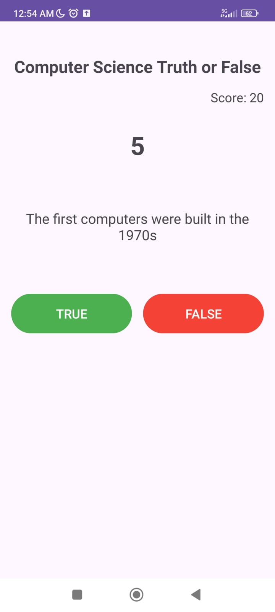
  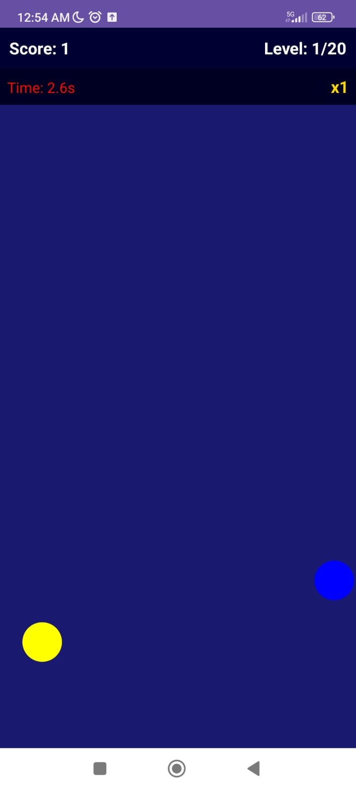
  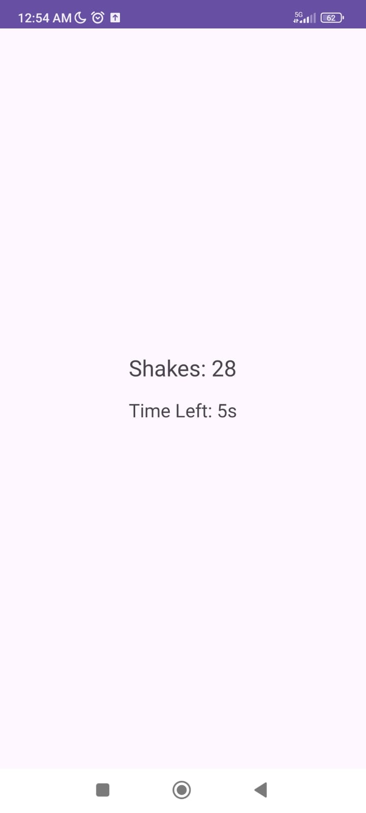
  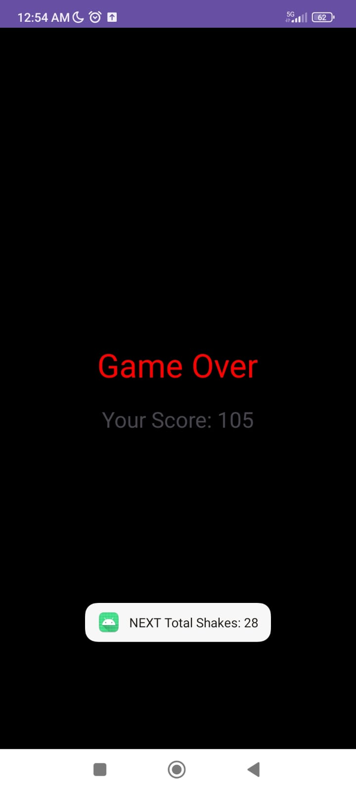
  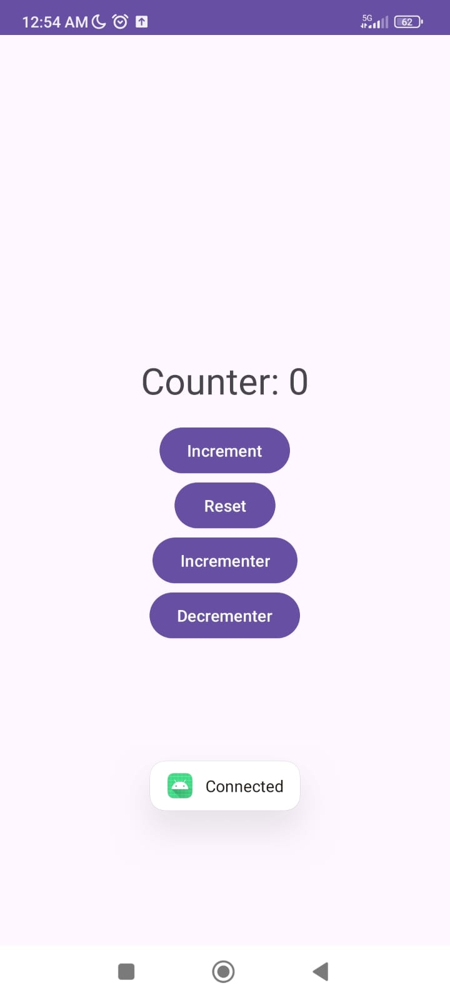
  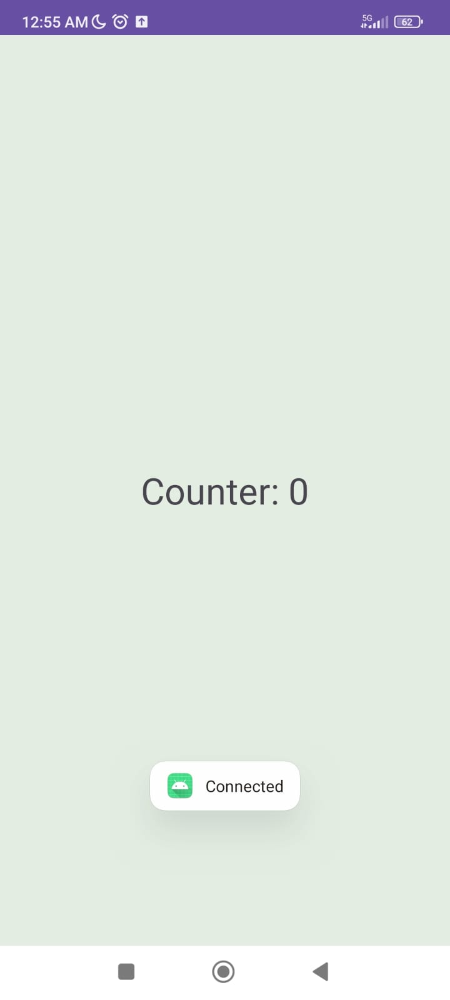
</div>

---

## Why firebase 

We tried to setup bluetooth by referreing to android studio bluetooth documentation, many problems where encoutered as methods found in documentation were stated 
as depracated. After successfully setting up bluetooth (code in BluetoothService) and opening a socket between connected devices, the devices weren't synchronizing 
and as time started getting tight and we had to deliver something, we decided to change the strategy and ended up settling on Firebase as the set up was easy and efficient.


## 🤖 Possible Improvements

- 🎨 Custom avatars or profile features
- 🔔 Push notifications for challenges
- 🌍 Online matchmaking
- 📊 Analytics for player performance

---

## 💡 Difficulties encountered
Apart from synchronization or bluetooth issues we had, crashing activities was a frustrating experience. As it can be seen on the code of every challenge activity,
we made sure to finish every activity once it's done, this enabled a safer app. Logcat was extremly helpful to understand activites unexpected behavior.
The fact that we had to dispose of two physical devices to effectively test multiplayer mode limited us in terms of possibilities too.


---


## 👨‍💻 Feedback

The openess of the project was much appreciated by me and my collegue. Overall, it was an interesting and enriching experience. We had the feeling that we were learning something new, compared to other academic subjects. The project involved a lot of thinking, how to finish each challenge, how to serialize challenges, how to track user's performance across challenges, how to communicate data between activities and many more.
We learnt to debug more than coding, which taught us a lot about real software development. 
We would like to thank the teacher for this experience.


